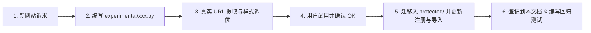

# 网站图片解析规则库与保护规范文档 (Image Parsing Rules & Protection Registry)

> **文档版本**：v1.1
>
> **同步日期**：2026-10-01
> **生效时间**：2026-09-21  
> **管理规范**：本规范定义了无限画布便签系统中各网站链接封面头图、标题及元数据的解析规则。  
> **保护机制**：站点例外规则位于 `backend/services/scrapers/protected/`；已确认可用的通用基础规则 G-001 位于 `backend/services/scrapers/fallback.py`。未经用户明确指令，不修改这些规则的核心解析逻辑。

---

## 一、 保护库管理守则 (Protection Protocol)

1. **准入规则（OK 确认制）**：
   - 新链接先适用通用规则 G-001；只有通用规则解析不正确的网站才在 `experimental/`（试验库）建立站点例外；
   - 必须经过真实网页测试（包括封面完整度、比例、反爬防御与标题准确性）；
   - **仅当用户明确回复“OK”或“可以”确认后**，方可由开发者/AI 迁移入 `protected/`（保护库）并在此文档登记为锁定状态。
2. **冻结原则（严禁擅自修改）**：
   - 处于 `protected/` 目录下的站点例外规则及 G-001 通用基础规则视为“冻结资产”；
   - 面对通用优化、整体重构、依赖升级等场景时，**严禁修改上述锁定解析逻辑**；
   - 如需变更保护库规则，必须由用户发出明确、具体的指令（如：“修改 B 站解析规则……”）。
3. **自动化测试守卫**：
   - 每个保护库规则必须在 `backend/tests/test_protected_scrapers.py` 中拥有基准测试（Gold Tests）；
   - 任何改动若导致保护库规则测试失败，均视为严重回退（Regression），必须立即回滚。

---

## 二、 规则全景总表 (Registry Overview)

| 规则编号 | 目标平台 | 适用域名 | 规则状态 | 用户确认(OK) | 核心解析策略 | 头图来源与品质 |
| :--- | :--- | :--- | :---: | :---: | :--- | :--- |
| **P-001** | **Bilibili (哔哩哔哩)** | `bilibili.com`, `b23.tv` | 🔒 **已锁定** | 2026-09-20 (OK) | 官方公开 API (`/x/web-interface/view`, `/masterpiece`) | 提取 `pic` 字段，去除协议头前缀，最高清原图 |
| **P-002** | **Instagram** | `instagram.com`, `instagr.am` | 🔒 **已锁定** | 2026-09-21 (OK) | 服务端 Embed 预渲染机制 (`/embed/captioned/`) + 独立纯净 UA | 提取 `EmbeddedMediaImage` 原图，100% 原始构图比例 |
| **P-003** | **YouTube** | `youtube.com`, `youtu.be` | 🔒 **已锁定** | 2026-09-21 (OK) | 视频 ID 路由匹配 + 官方 oEmbed API + maxresdefault | 1280x720 16:9 全高清官方缩略图 |
| **P-004** | **Pinterest** | `pinterest.com`, `pin.it` | 🔒 **已锁定** | 2026-09-21 (OK) | OpenGraph 协议解析 + `/originals/` 原始画质升频 | 探测并获取未压缩原始原图，100% 构图比例 |
| **P-005** | **X / Twitter** | `x.com`, `twitter.com` | 🔒 **已锁定** | 2026-10-01 (OK) | FxTwitter 开放元数据接口 + Twitterbot SSR 直扫回退 | 优先使用文章或动态自身封面，其次使用所附链接预览图；无图时保持紧凑卡片 |
| **P-007** | **Shen’s Blog** | `shens.blog` | 🔒 **已锁定** | 2026-10-01 (OK) | 通过本地代理读取页面 OpenGraph / Twitter 元数据 | 使用文章自身 `og:image`；页面无图时不生成网站截图 |
| **E-001** | **飞书 (Feishu / Lark)** | `feishu.cn`, `larksuite.com` | ⏳ **试验区** | 无封面信息卡 | 文档路径识别 + 公开页面标题元数据 + 鉴权降级 | 统一不解析或展示封面；标题前显示飞书图标 |
| **G-001** | **通用网页基础规则** | 无站点例外匹配的 HTTP(S) 链接 | 🔒 **已锁定** | 2026-10-01 (OK) | OpenGraph ➔ Twitter Cards ➔ Headless 视口截图 | 优先页面元数据图片；无图且非鉴权页时截图 |

---

## 三、 受保护规则详细技术档案 (Protected Rules Specification)

### 🔒 规则 P-001: 哔哩哔哩 (Bilibili)
- **保护文件**：[`backend/services/scrapers/protected/bilibili.py`](file:///c:/Users/lalala/Desktop/note/backend/services/scrapers/protected/bilibili.py)
- **适用场景**：
  - B 站视频链接（含 `BV...` 或 `av...`）
  - B 站短链（`b23.tv/...` 自动追踪 302 重定向解析）
  - UP 主个人空间主页（`space.bilibili.com/{mid}`）
- **核心逻辑**：
  1. 提取视频 `BV号` / `av号`，调用官方高稳定性公开 API：`https://api.bilibili.com/x/web-interface/view?bvid=...`；
  2. 提取个人空间 `mid`，调用代表作公开接口：`https://api.bilibili.com/x/space/masterpiece?vmid=...`；
  3. 请求头携带 `Referer: https://www.bilibili.com`，并使用已检测到的本地代理请求 API；
  4. API 失败时读取视频页的 OpenGraph 标题与 `/bfs/archive/` 原生封面；视频链接不会降级为网站截图；
  5. 头图 URL 统一为 HTTPS，前端加载封面时不发送来源页地址。

---

### 🔒 规则 P-002: Instagram
- **保护文件**：[`backend/services/scrapers/protected/instagram.py`](file:///c:/Users/lalala/Desktop/note/backend/services/scrapers/protected/instagram.py)
- **适用场景**：
  - 帖子（`instagram.com/p/{shortcode}`）
  - Reels 短视频（`instagram.com/reel/{shortcode}`）
  - IGTV 视频（`instagram.com/tv/{shortcode}`）
  - 创作者公开主页（`instagram.com/{username}`）
- **核心逻辑**：
  1. 将帖子 URL 重写为官方 Embed 渲染终端：`https://www.instagram.com/p/{shortcode}/embed/captioned/`；
  2. **防封与规避空白核心**：使用纯净桌面 UA，坚决不发送 `Accept-Language: zh-CN`，并通过已检测到的本地代理请求嵌入页；
  3. 从 HTML 中精准提取 `class="EmbeddedMediaImage"` 的高清封面原图，并格式化作者与正文配文；
  4. 配合前端自适应宽高比，完美呈现 1:1、4:5 与 16:9 画幅。

---

### 🔒 规则 P-003: YouTube
- **保护文件**：[`backend/services/scrapers/protected/youtube.py`](file:///c:/Users/lalala/Desktop/note/backend/services/scrapers/protected/youtube.py)
- **适用场景**：
  - 视频链接（`youtube.com/watch?v={id}`）
  - 纯短链（`youtu.be/{id}`）
  - 短视频 Shorts（`youtube.com/shorts/{id}`）
- **核心逻辑**：
  1. 正则精确提取 11 位标准视频 ID；
  2. 优先请求 `https://i.ytimg.com/vi/{id}/maxresdefault.jpg`，获取 1280x720 超高清官方宽屏头图；若老视频无全高清图，自动回退到 `hqdefault.jpg`；
  3. 通过官方公开 `https://www.youtube.com/oembed` 接口秒级拉取视频标题与 UP 主频道名称；
  4. 自动匹配 YouTube 官方 Favicon 图标。

---

### 🔒 规则 P-004: Pinterest
- **保护文件**：[`backend/services/scrapers/protected/pinterest.py`](file:///c:/Users/lalala/Desktop/note/backend/services/scrapers/protected/pinterest.py)
- **适用场景**：
  - 画板 Pin 详情（`pinterest.com/pin/{id}`、`*.pinterest.com/pin/...`、`pin.it/...`）
- **核心逻辑**：
  1. 自动探测并接入本地代理端口（如 7897, 7890）；
  2. 提取 OpenGraph 元数据，并启动**原图品质升频引擎**：将 CDN 缩略路径 `/736x/` 替换为 `/originals/` 并校验可达性，优先输出未被压缩的 100% 原始设计素材图；
  3. 卡片根据图片自然高宽比自适应拉伸高度，完美呈现 Pinterest 常见的修长瀑布流灵感图。

---

### 🔒 规则 P-005: X / Twitter
- **保护文件**：[`backend/services/scrapers/protected/x_twitter.py`](file:///c:/Users/lalala/Desktop/note/backend/services/scrapers/protected/x_twitter.py)
- **当前状态**：🔒 **已锁定**（2026-10-01 经用户确认 OK 锁定）；
- **适用场景**：
  - 推文/状态帖子链接（`x.com/{user}/status/{id}`, `twitter.com/{user}/status/{id}`, `x.com/i/status/{id}`, `mobile.twitter.com/...`）
  - 用户主页（`x.com/{username}`）
- **核心逻辑**：
  1. 正则精确提取 `username` 与 `status_id`；
  2. 优先调用 `https://api.fxtwitter.com/{user}/status/{id}`，提取正文、作者和媒体；文章分享使用 `article.title` 与文章封面，普通动态优先使用自身照片或视频封面，没有自身媒体时使用所附链接卡片的 `card.image.url`；
  3. 二级容灾：若 FxTwitter 超时或受阻，自动回退到 `Twitterbot/1.0` 专用 UA 直扫 SSR 预渲染元数据；
  4. **标题与内容智能组合**：
     - 将卡片标题由单一作者名优化为：`作者: “推文摘要内容”`（如 `jack: “just setting up my twttr”`）；
     - 完整推文内容存入卡片 `description`，支持画布内全文搜索与鼠标悬浮预览；
  5. **动效生命周期与时机**：
     - 前端解析状态使用 `isParsing`，卡片容器在该字段为真时显示旋转图标与解析提示，元数据处理完成后清除；
     - `createCardAtCursor` 会将 `isParsing` 写入新卡片；图片 OCR、网页元数据和重新解析期间显示整卡旋转图标，完成或失败后清除。该临时状态不写入持久化数据。

---

### ⏳ 规则 E-001: 飞书 (Feishu / Lark)
- **试验文件**：`backend/services/scrapers/experimental/feishu.py`
- **当前行为**：飞书/Lark 链接统一作为无封面信息卡，保留公开标题和私密文档的标题降级；标题前显示飞书图标。图片元数据不再用于封面，因此继续留在试验区。
- **历史编号**：P-006 已撤回且不复用，避免与先前记录混淆。

### 🔒 规则 P-007: Shen’s Blog
- **保护文件**：`backend/services/scrapers/protected/shens_blog.py`
- **适用域名**：`shens.blog` 及 `www.shens.blog`。
- **核心策略**：通过已检测到的本地代理请求文章页面，优先读取 `og:title` 和 `og:image`，再尝试 Twitter 元数据；封面使用文章自身图片，页面没有图片时保持无图。

---

## 四、 通用基础规则与站点例外

### 🔒 规则 G-001: 通用元数据与截图
- **实现文件**：`backend/services/scrapers/fallback.py`；当前行为已获用户确认，后续站点问题优先新增或修改对应例外规则。
- **适用方式**：所有 HTTP(S) 链接默认适用；注册表先检查保护区和试验区的站点例外，未匹配时执行 G-001。例外规则有结果时覆盖通用规则。
- **页面请求**：优先使用已检测到的本地代理获取原始 HTML，再读取页面元数据；
- **提取顺序**：
  1. HTML Meta 标签：`og:image` ➔ `twitter:image`；当前通用实现没有 `itemprop="image"` 回退；
  2. 标题提取：`og:title` ➔ `twitter:title` ➔ `<title>`；
  3. 网站图标：`<link rel="icon">` ➔ `domain.com/favicon.ico`；
  4. **智能视口截屏兜底**：
     - 若页面未提供 `og:image`，且目标不是鉴权/登录页（自动检查 `login`, `signin`, `auth`, `passport` 等关键词），自动调用无头浏览器对首屏视口（1280x800）截图；
     - 自动探测本地网络代理端口（如 7897, 7890 等），确保海外合规网站能正常渲染出图；
     - 截图缓存至 `backend/data/screenshots/` 并返回静态路由路径。

---

## 五、 新规则扩展流程 (Incubation Workflow)

迁移时还须更新 `protected/__init__.py`、`experimental/__init__.py`、回归测试以及 PRD 的站点列表。当前保护库包含 P-001～P-005、P-007 六个站点例外，试验库包含飞书 E-001；G-001 是单独锁定的通用基础规则。`registry.py` 依次调用匹配的保护库、试验库，未取得结果时使用 G-001。

当前回归测试主要覆盖规则状态、URL 匹配及注册列表，不能代替真实网页封面和标题验证。表中的画质描述是解析策略所尝试取得的目标，受原站内容、鉴权、网络和反爬变化影响，不保证每次成功或固定分辨率。

图片资源分为上传图片（`data/assets/`）、网页截图（`data/screenshots/`）和远程封面 URL。JSON 备份不会打包 URL 指向的文件，跨环境恢复与离线边界见 PRD 第 2 节。

## 六、截图反向识别与保护库边界

图片卡的“识别原链接”使用 `POST /api/resolve-image`：先 OCR，优先读取截图中明确出现的 URL/BV 号；B 站电脑端截图及手机竖屏截图再从 OCR 布局提取标题、UP 主与可见时长，经 B 站搜索候选核验后返回链接。搜索接口遇到 HTTP 412 或无结果的 `v_voucher` 时尝试备用接口与失败页重试；已核实匹配只在当前后端进程内缓存。未达到可信阈值时保留原图片卡，用户可单独选择“OCR 识别”转换成文本卡。X 截图目前使用通用文字搜索，不能保证找回原帖。

这条反向识别链路位于 `backend/services/bilibili_reverse_service.py` 和 `backend/services/screenshot_link_service.py`，不属于 P-001 B 站链接的正向元数据/封面解析规则。反向识别成功后，网页卡元数据仍由原有解析调度获取；P-001 与 G-001 的保护约束保持适用。
